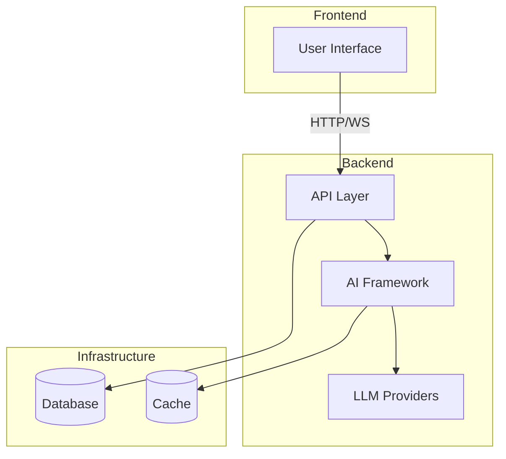

# AI-SDK-LANGGRAPH

[](https://github.com/mk-knight23/AI-SDK-ECOSYSTEM)
[](https://github.com/langchain-ai/langgraph)
[](https://kit.svelte.dev/)
[](https://nodejs.org/)

> **Framework**: LangGraph (Stateful Agent Workflows)
> **Stack**: SvelteKit 2 + Node.js

---

## 🎯 Project Overview

**AI-SDK-LANGGRAPH** showcases stateful agent workflows using LangGraph. It demonstrates cyclic graph topology, persistent state management, checkpointing, and human-in-the-loop approval patterns for building production AI agent systems.

### Key Features

- 🕸️ **Cyclic Graph Workflows** - Non-linear agent conversation flows
- 💾 **State Persistence** - Long-term memory across sessions
- 🔄 **Checkpointing System** - Save and restore agent state
- 🤖 **Multi-Agent Systems** - Multiple agents coordinating via LangGraph
- 📡 **Real-time Updates** - WebSocket streaming of agent execution

---

## 🛠 Tech Stack

| Technology | Purpose |
|-------------|---------|
| SvelteKit 2 | Full-stack framework |
| Node.js 20 | Runtime |
| LangGraph | Agent orchestration |
| WebSocket | Real-time communication |
| Skeleton UI | Loading states |

---

## 🚀 Quick Start

```bash
npm install
npm run dev
```

---

## 🔌 API Integrations

| Provider | Usage |
|----------|-------|
| OpenAI | Primary LLM |
| Anthropic | Fallback LLM |

---

## 📦 Deployment

**Fly.io**

```bash
fly deploy
```

---

## 📁 Project Structure

```
AI-SDK-LANGGRAPH/
├── src/              # SvelteKit source
│   ├── routes/      # API routes + agent endpoints
│   └── lib/         # LangGraph graphs
└── README.md
```

---

## 📝 License

MIT License - see [LICENSE](LICENSE) for details.

---


---

## 🏗️ Architecture



---

## 📡 API Endpoints

| Method | Endpoint | Description |
|--------|----------|-------------|
| GET | /health | Health check |
| POST | /api/execute | Execute agent workflow |
| WS | /api/stream | WebSocket streaming |

---

## 🔧 Troubleshooting

### Common Issues

**Connection refused**
- Ensure backend is running
- Check port availability

**Authentication failures**
- Verify API keys in `.env`
- Check environment variables

**Rate limiting**
- Implement exponential backoff
- Reduce request frequency

---

## 📚 Additional Documentation

- [API Reference](docs/API.md) - Complete API documentation
- [Deployment Guide](docs/DEPLOYMENT.md) - Platform-specific deployment
- [Testing Guide](docs/TESTING.md) - Testing strategies and coverage
---


**Part of the [AI-SDK Ecosystem](https://github.com/mk-knight23/AI-SDK-ECOSYSTEM)**
